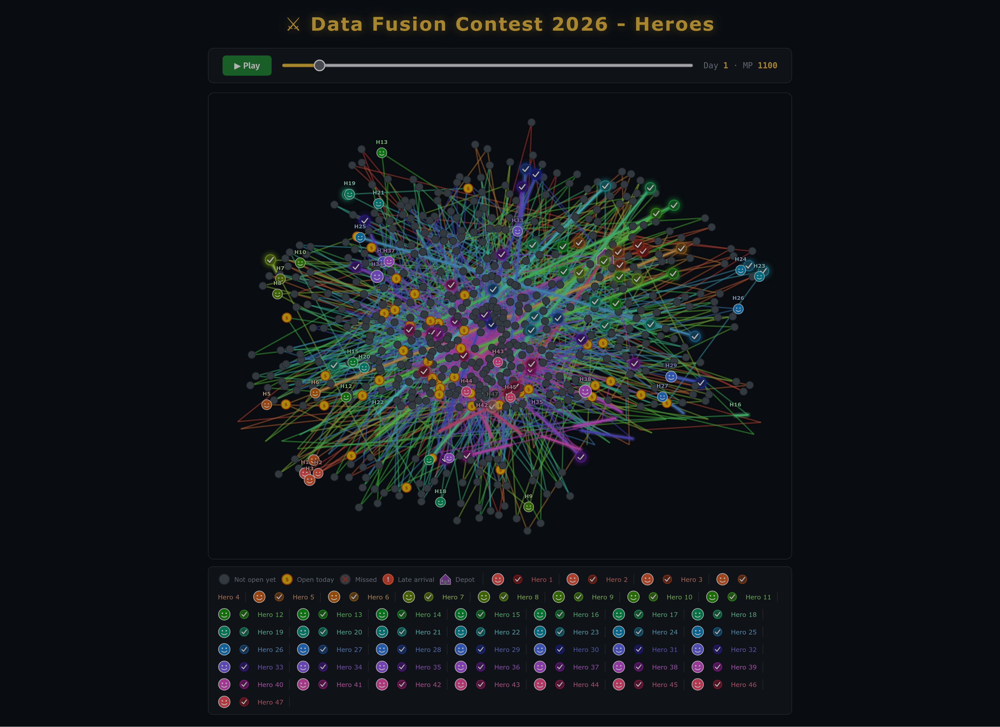

# 🗺️ Data Fusion 2026 — Задание 3 - Визуализатор решений

> 🌐 Язык / Language: **🇷🇺 Русский** | [🇬🇧 English](README_en.md)


Интерактивная визуализация для решений [задачи 3 Data Fusion 2026](https://ods.ai/competitions/data-fusion2026-heroes). Показывает перемещения героев, состояние мельниц и тайминги на протяжении 7‑дневной игровой недели. Автономный файл, работает в любом браузере.

---

## 🧭 Генерация координат

Перед использованием визуализатора создайте `coords.csv` из матриц расстояний, предоставленных в соревновании:

```bash
python generate_coords.py
```

**Зависимости:** `pandas`, `numpy`, `networkx`  
**Входные файлы:** `dist_objects.csv`, `dist_start.csv`  
**Выходной файл:** `coords.csv` с колонками `node_id`, `x`, `y`.

---

## 🚀 Генерация визуализации

### 📁 Входные данные

| Файл               | Описание                                                |
| ------------------ | ------------------------------------------------------- |
| `coords.csv`       | Координаты узлов (депо + 700 мельниц)                   |
| `data_objects.csv` | Метаданные мельниц: `object_id`, `day_open`, `reward`   |
| `data_heroes.csv`  | Метаданные героев: `hero_id`, `move_points`             |
| `solution_*.csv`   | Ваше решение: последовательности `hero_id`, `object_id` |

---

```python
from generate_visualization import generate_visualization

generate_visualization()                       # использует решение по умолчанию
generate_visualization('my_solution.csv', 'viz.html')
```

Результат: один `.html` файл – не требует сервера.

---

## 🖥️ Интерфейс

- **Холст:** 1000×800 пикселей, узлы размещены с помощью `coords.csv`.
- **Маршруты:** У каждого героя уникальный цвет; статические пути + светящийся сегмент текущего перемещения.
- **Управление:** Воспроизведение/пауза, ползунок времени, отображение текущего дня и потраченных очков хода.


---

## 🎨 Состояния узлов

| Иконка | Состояние        | Значение                               |
| ------ | ---------------- | -------------------------------------- |
| ⬤      | Ещё не открыта   | `current_day < day_open`               |
| 💰      | Открыта сегодня  | `current_day == day_open`, не посещена |
| ✅      | Посещена вовремя | получена награда (500 золота)          |
| ❗      | Опоздание        | посещена после `day_open`, без награды |
| ✖      | Пропущена        | день прошёл, никогда не посещена       |
| 🏰      | Депо             | узел 0                                 |

Посещённые узлы окрашиваются в цвет (тёмный оттенок) посетившего их героя.